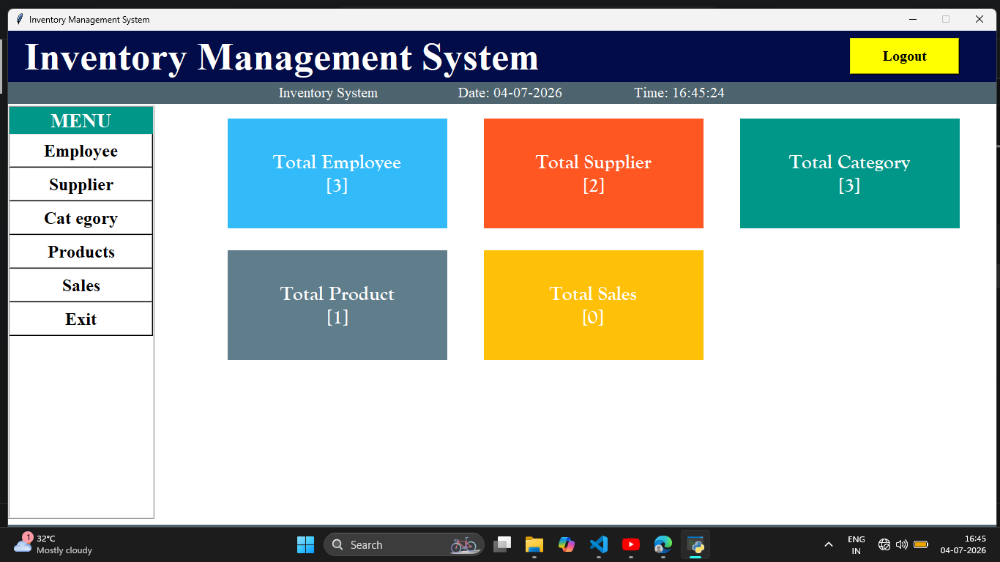

🛒 Inventory Management System

A desktop-based **Inventory Management System** built using **Python**, **Tkinter**, and **SQLite3**. This application helps manage products, categories, suppliers, employees, billing, and sales through an easy-to-use graphical interface.

## 🚀 Features

- 👤 Employee Management
- 📦 Product Management
- 🗂️ Category Management
- 🚚 Supplier Management
- 🧾 Billing System
- 💰 Sales Management
- 📊 Dashboard with inventory statistics
- 💾 SQLite database integration
- 🖥️ User-friendly GUI using Tkinter

## 🛠️ Tech Stack

- **Language:** Python
- **GUI:** Tkinter
- **Database:** SQLite3
- **IDE:** Visual Studio Code

## 📂 Project Structure

```
Inventory_Project/
│
├── dashboard.py
├── employee.py
├── supplier.py
├── category.py
├── product.py
├── sales.py
├── billing.py
├── create_db.py
├── ims.db
├── bill/
└── README.md
```

## ⚙️ Installation

1. Clone the repository

```bash
git clone https://github.com/your-username/Inventory-Management-System.git
```

2. Navigate to the project folder

```bash
cd Inventory-Management-System
```

3. Install Python (3.10 or above)

4. Run the database script (if required)

```bash
python create_db.py
```

5. Start the application

```bash
python dashboard.py
```

## 📸 Screenshots

You can add screenshots of:

- Dashboard
- Product Module
- Billing Window
- Sales Window

(Create a folder named **screenshots** and upload images.)

Example:

```
screenshots/
    dashboard.png
    billing.png
```

Then include

```md
## Dashboard


```

## 🎯 Future Improvements

- Login Authentication
- Barcode Scanner Support
- Export Bills to PDF
- Email Invoice
- Sales Analytics Dashboard
- Cloud Database Integration

## 📚 Learning Outcomes

Through this project, I learned:

- GUI Development with Tkinter
- CRUD Operations
- SQLite Database Management
- Object-Oriented Programming
- Modular Python Programming
- Event-driven Programming

## 👩‍💻 Author

**Riya Shankar**

LinkedIn:
https://www.linkedin.com/in/riya-shankar-3b34a8383

GitHub:
https://github.com/your-github-username
